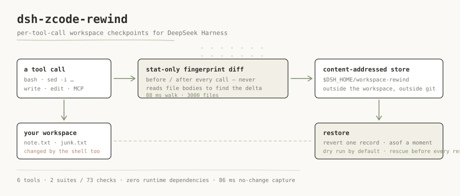

# dsh-zcode-rewind

[English](./README.md) | [简体中文](./README.zh.md)

[](https://github.com/BOWLUNA/dsh-zcode-rewind/actions/workflows/test.yml)
[](./LICENSE)
[](./package.json)
[](./package.json)

> Per-tool-call workspace checkpoints for DeepSeek Harness — every file mutation, shell side effects included.

```bash
dsh plugin --profile web add dsh-zcode-rewind
```



### What this catches that the other rewind plugins do not

Four plugins in this market solve a neighbouring problem. The difference is not a matter of taste —
it is one decision each, and `node tools/compare-capture.mjs` replays the same shell-made mutation
against all five criteria and prints what each one records:

| what the others do | what this does instead | evidence |
| --- | --- | --- |
| `dsh-rewind-plugin` 0.12.2 reads `args.file_path` off write/edit calls, so a `sed -i` — which has no such argument — never appears | a stat-only fingerprint diff around **every** tool call, so a mutation made by the shell is exactly as visible as one made by a file tool | `node tools/compare-capture.mjs` |
| `@anionex/dsh-turn-rewind` 0.3.8 snapshots at **turn boundaries**, so a mutation made mid-turn is not in this round's record | the diff is taken per tool call, not per turn | same command |
| `dsh-undo-savepoint` 0.4.9 keeps a tool whitelist and does not cover ordinary workspace files | covers the workspace by default — only `.git` and `node_modules` are excluded | same command |
| `dsh-recall-plugin` 2.3.24 sees the change but restores at **whole-tree** granularity | records the path set of each individual change, and `revert` undoes exactly one record | same command |

## Where this sits next to ZCode

This plugin studies the same problem ZCode solves and ports it to DSH. The honest version of that
relationship — including the part where nothing was taken:

| ZCode | what was taken | where this goes further | evidence |
| --- | --- | --- | --- |
| `zcode/apps/zcode-cli/packages/adapters/src/plugins/atomic-directory.ts` — atomic directory activation with `finalize` / `rollback`, used when installing plugin sources | nothing | not the same problem: that rolls back an **install**, not a workspace | `grep -n "rollback" …/atomic-directory.ts` |
| no workspace-level checkpoint subsystem in `zcode/apps` | the *idea*, not the code | **ZCode has no counterpart here** — the capture loop, the store layout and the restore semantics are this repository's own work | `grep -rli "snapshot" zcode/apps` → 232 files; the ones inspected are session and UI snapshots, not a workspace store |

Derivation credit: the idea of checkpointing an agent's workspace is studied from
[`zai-org/ZCode`](https://github.com/zai-org/ZCode) and
[`zai-org/GLM-skills`](https://github.com/zai-org/GLM-skills). **Nothing in the install path, the
tests, or the acceptance criteria depends on any third-party vendor key or service** — model
capability, where this plugin needs it at all, goes through the host's own `ctx.llm`.

## Why

Every checkpoint system we could find only tracks changes made through file-editing tools.
The Claude Code documentation says it outright: "Checkpointing does not track files modified by
Bash commands" — `rm file.txt`, `mv old.txt new.txt`, `cp source.txt dest.txt` cannot be undone
through rewind. Cline does catch command side effects, but by committing the whole repository to a
shadow git repository after every tool call, and its own documentation warns that large repositories
suffer significant storage use and slowdown.

DSH's own market is no different: all four rollback plugins we read (`dsh-rewind-plugin`,
`@anionex/dsh-turn-rewind`, `dsh-undo-savepoint`, `dsh-recall-plugin`) either parse only the
`file_path` argument of `write`/`edit`, or snapshot at turn boundaries — so a `sed -i` mid-turn is
invisible to all of them.

## What it captures

- Every mutating tool call: `bash`, `pwsh`, `write`, `edit`, MCP tools, subagent tools.
- Deletions, creations and modifications — with a revertible previous-content hash for each path.
- Content-addressed file contents, deduplicated across sessions and workspaces.
- A durable ledger of who changed what, in entry order, that survives restarts.

## How it works

```text
tools/execute (before) ──> mark pending; first capture writes a full baseline
        │  (the tool runs: bash rm/mv/sed, write, edit, MCP …)
tools/post-execute ─────> fingerprint diff → read changed files →
                          content-addressed blobs (sha-256, deduped) →
                          append-only ledger record
```

The fingerprint is `path → size + mtime` for the whole workspace. Capture costs one `O(files)` stat
walk plus content reads **only for files that actually changed** — measured at 88 ms for 3000 files,
against 2936 ms for the initial full-content baseline, i.e. 86 ms for a no-change capture.

## Install

```bash
dsh plugin --profile web add dsh-zcode-rewind
```

Restart DSH — a bundle plugin binds during startup assembly. Verify the composed tree with
`dsh --profile web --dump-config | grep workspace-rewind`. The store lives outside your workspace,
at `$DSH_HOME/workspace-rewind/`, and never touches your git repository.

## Tools

| Tool | What it does |
| --- | --- |
| `rewind_now` | Create a manual checkpoint right now, e.g. before a risky operation |
| `rewind_list` | Recent records, newest first: id, time, tool, `+added ~modified -deleted`, sample paths |
| `rewind_diff` | Restore plan plus a line-level unified diff; changes nothing |
| `rewind_restore` | `mode=revert` undoes one record; `mode=asof` returns to a point in time |
| `rewind_undo` | Undo the last restore — repeating it toggles undo/redo |
| `rewind_status` | Store statistics: records, blobs, bytes, quota, active configuration |

## Configuration

```yaml
- insert:
    - id: workspace-rewind
      name: 'dsh-zcode-rewind'
      config:
        capture: all            # all | fileTools | off
        maxFileBytes: 8388608   # larger files are recorded as events only
        maxFiles: 20000         # per-walk file cap
        maxTotalBytes: 536870912  # store quota; oldest unreferenced blobs are evicted
        keepRecords: 500        # ledger trim threshold
        excludes: ['.git', 'node_modules', 'dist']
        secretNames: ['.env', '*.pem', '*.key']
```

## Restore semantics

| Mode | Meaning |
| --- | --- |
| `revert` | Undo exactly the delta of one record — the "undo what just broke" case |
| `asof` | Return the workspace to the state recorded at a checkpoint, folding the ledger and resolving files created after the target |

## Safety

- Restores are dry-run by default; `apply=true` is required to touch the filesystem.
- Every restore first writes a rescue record, so `rewind_undo` can reverse it — repeatedly.
- Restore and rescue records are exempt from quota eviction: the undo trail is never evicted.
- Secret-named and oversized files are recorded as events only, and a restore plan keeps them
  untouched rather than guessing their history.

## Compatibility

Developed and verified on DSH `0.1.5-rc.2` (desktop harness) and `0.1.6-alpha.2` (WSL). The declared
range is:

```text
>=0.1.5-alpha.1 || >=0.1.6-alpha.1
```

Host APIs used: `ctx.tools.register` with `defineTool`, `ctx.inject(['fs'], …)` and the
`tools/execute` / `tools/post-execute` / `tools/result` events, `ctx.systemPrompt.section`,
`ctx.logger`, plus `resolveDshHome()` from `@deepseek-ai/dsh-home-paths`. Peers are resolved through a
multi-anchor `createRequire`, so a `link:`-installed copy works without a local `node_modules`.

## Tests and guards

```bash
node test/run.mjs                                    # 2 suites, 73 checks — no DSH required
node tools/verify-translation-pairing.mjs --write     # bilingual pair hashes
node tools/verify-doc-numbers.mjs                     # documented numbers vs the real run
node tools/verify-version-consistency.mjs --dsh 0.1.6-alpha.2
node tools/boot-check.mjs --port 31860               # needs pnpm + a harness install
```

The last guard is the only one that installs the plugin into a throwaway `DSH_HOME` and boots it.
It exists because 1.0.0 installed cleanly, passed every unit test and produced a clean `--dump-config`
— and then took the whole profile down at boot, because one word in `cordis.patch.yml` still named
the package as it was called before the rename.

## Known limitations

- External edits made between tool calls are attributed to the next captured call, the same class of
  limitation as a whole-tree shadow commit.
- Files whose content was never captured — secret-named, oversized, or deleted before first capture —
  cannot be content-restored; plans keep them as they are and say so.
- Massive monorepos need a larger `excludes` list or `capture: fileTools`.

## License

MIT
