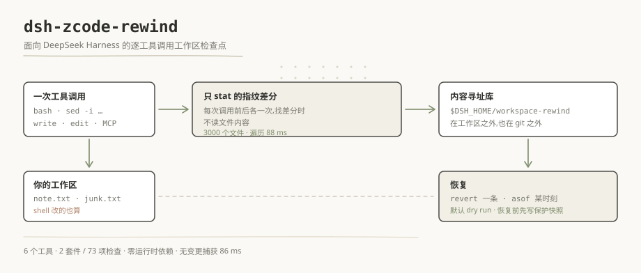

# dsh-zcode-rewind

[English](./README.md) | **简体中文**

[](https://github.com/BOWLUNA/dsh-zcode-rewind/actions/workflows/test.yml)
[](./LICENSE)
[](./package.json)
[](./package.json)

> 面向 DeepSeek Harness 的逐工具调用工作区检查点——连 shell 副作用一起捕获。

```bash
dsh plugin --profile web add dsh-zcode-rewind
```



### 这件事上,它比同类的回滚插件多做了什么

市场里另有四个插件在解一个相邻的问题。区别不是口味问题,而是各自的一个决定——
`node tools/compare-capture.mjs` 会把**同一次 shell 造成的改动**喂给五套判据,并打印各自记录到了什么:

| 它们怎么做 | 本插件怎么做 | 证据 |
| --- | --- | --- |
| `dsh-rewind-plugin` 0.12.2 从 write/edit 调用里取 `args.file_path`——而 `sed -i` 没有这个参数,于是永远不出现 | 每次工具调用前后做一次**只 stat 的指纹差分**,shell 造成的改动与文件工具造成的改动一样可见 | `node tools/compare-capture.mjs` |
| `@anionex/dsh-turn-rewind` 0.3.8 在 **turn 边界**打快照,所以 turn 中途的改动不进这一轮记录 | 差分的粒度是每次工具调用,不是每个 turn | 同上 |
| `dsh-undo-savepoint` 0.4.9 有工具白名单,且不覆盖工作区里的普通文件 | 默认覆盖整个工作区——只排除 `.git` 与 `node_modules` | 同上 |
| `dsh-recall-plugin` 2.3.24 看得见改动,但还原粒度是**整棵树** | 记录每一次改动各自的路径集,`revert` 精确抵消一条记录 | 同上 |

## 与 ZCode 的关系

本插件研究的是 ZCode 所解的同一个问题,把它移植到 DSH。下面是这段关系的如实版本——
包括「什么都没取」的那一行,**也包括你从这里复核不了的那部分**:

| ZCode | 取到了什么 | 本插件进一步在哪 | 从本仓库能复核吗 |
| --- | --- | --- | --- |
| `zcode/apps/zcode-cli/packages/adapters/src/plugins/atomic-directory.ts`——装插件源码时的原子目录切换,有 `finalize` / `rollback` | 没有 | 不是同一个问题:那个回滚的是**一次安装**,不是工作区 | **从本仓库推不出来。** ZCode 镜像没有随仓库提供,所以唯一诚实的说法是「2026-09-22 读过,而你无法从本仓库的 clone 里复跑它」 |
| `zcode/apps` 里没有工作区级的检查点子系统 | 借的是**想法**,不是代码 | **ZCode 在这一块没有对应物**——捕获循环、库的布局、恢复语义都是本仓库自己的活儿 | **从本仓库推不出来**——同上 |

出处致谢:给 agent 的工作区做检查点这个想法,学习自
[`zai-org/ZCode`](https://github.com/zai-org/ZCode) 与
[`zai-org/GLM-skills`](https://github.com/zai-org/GLM-skills)。**安装路径、测试与验收条件里
没有任何一处依赖第三方厂商的 key 或服务**——本插件需要模型能力时一律走宿主自己的 `ctx.llm`。

### 怎么自己复核这张表

上面**第一张**表是你真能复跑的;第二张则明说它无法从 clone 里复核。这个区别是刻意保留的——
复核不了的主张不算证据。

```bash
git clone https://github.com/BOWLUNA/dsh-zcode-rewind && cd dsh-zcode-rewind
node test/run.mjs                  # 2 套件 / 73 项检查——不需要装 DSH
node tools/compare-capture.mjs     # ← 第一张表的证据
node tools/boot-check.mjs --port 31860   # 可选;需要 pnpm 与一份 dsh 安装(见下)
```

`compare-capture` 会把一次 shell 造成的改动喂给五套判据、打印各自记录到什么,
并**断言表里那三条主张**——所以哪天文档与代码各说各话,它会以非零退出。

## 为什么做这个

我们能找到的检查点实现,都只追踪「文件编辑工具」造成的改动。Claude Code 官方文档把话说得很直:
「检查点不追踪被 Bash 命令修改的文件」——`rm file.txt`、`mv old.txt new.txt`、
`cp source.txt dest.txt` 都无法通过 rewind 撤销。Cline 确实能捕获命令副作用,代价是每次工具调用后
把整个仓库提交进一个 shadow git,而它自己的文档提醒:大仓库会明显吃存储、明显变慢。

DSH 自己的市场也一样:我们读过的四个回滚插件(`dsh-rewind-plugin`、`@anionex/dsh-turn-rewind`、
`dsh-undo-savepoint`、`dsh-recall-plugin`)要么只解析 `write`/`edit` 的 `file_path` 参数,
要么只在 turn 边界打快照——所以一个 turn 中途的 `sed -i`,它们全都看不见。

## 它捕获什么

- 每一次会改动文件的工具调用:`bash`、`pwsh`、`write`、`edit`、MCP 工具、子代理工具。
- 删除、新建、修改——每个路径都带一个**可还原的改动前内容哈希**。
- 内容寻址的文件内容,跨会话、跨工作区去重。
- 一份持久账本:谁在什么顺序上改了什么,重启后仍在。

## 工作原理

```text
tools/execute (before) ──> 登记 pending;首次捕获写一份全量基线
        │  (工具执行: bash rm/mv/sed、write、edit、MCP …)
tools/post-execute ─────> 指纹差分 → 读变化文件 →
                          内容寻址 blob 库(sha-256,去重)→
                          追加式账本记录
```

指纹是整棵工作区的 `路径 → 大小 + mtime`。每次捕获的成本是一次 `O(文件数)` 的 stat 遍历,
加上**只对真正变化的文件**读内容——3000 个文件实测 88 ms;首次全量基线 2936 ms,
而零变更捕获只要 86 ms。

## 安装

```bash
dsh plugin --profile web add dsh-zcode-rewind
```

重启 DSH——bundle 插件在启动装配期生效。用
`dsh --profile web --dump-config | grep workspace-rewind` 验证合成树。快照库在工作区**之外**,
位于 `$DSH_HOME/workspace-rewind/`,绝不碰你的 git 仓库。

## 工具

| 工具 | 作用 |
| --- | --- |
| `rewind_now` | 立即手动建检查点,比如危险操作之前 |
| `rewind_list` | 最近记录(新→旧):id、时间、工具、`+新增 ~修改 -删除`、示例路径 |
| `rewind_diff` | 恢复计划 + 行级 unified diff,不改动任何文件 |
| `rewind_restore` | `mode=revert` 撤销单条记录;`mode=asof` 回到某个时间点 |
| `rewind_undo` | 撤销最近一次恢复——反复执行即 undo/redo 来回切 |
| `rewind_status` | 快照库状态:记录数、blob、占用、配额、当前配置 |

## 配置

```yaml
- insert:
    - id: workspace-rewind
      name: 'dsh-zcode-rewind'
      config:
        capture: all            # all | fileTools | off
        maxFileBytes: 8388608   # 超过此大小的文件只记事件
        maxFiles: 20000         # 单次遍历文件数上限
        maxTotalBytes: 536870912  # 快照库配额;超限淘汰最旧未引用 blob
        keepRecords: 500        # 账本裁剪阈值
        excludes: ['.git', 'node_modules', 'dist']
        secretNames: ['.env', '*.pem', '*.key']
```

## 恢复语义

| 模式 | 含义 |
| --- | --- |
| `revert` | 只抵消某一条记录的增量——「撤销刚才搞坏的东西」用这个 |
| `asof` | 把工作区回到某条检查点记录的状态:折叠账本,并正确处理 target 之后新建的文件 |

## 安全

- 恢复默认 dry-run;必须显式 `apply=true` 才会动文件系统。
- 每次恢复前先写一条 rescue 保护记录,所以 `rewind_undo` 能撤销它——而且可以反复撤销。
- restore / rescue 记录**豁免配额淘汰**:撤销链永远不会被清掉。
- 密钥样式的文件与超限文件只记事件,恢复计划**保持它们原样**,而不是去猜它们的历史。

## 兼容性

在 DSH `0.1.5-rc.2`(桌面版 harness 线)、`0.1.6-alpha.2`(WSL)与 `0.1.7-alpha.2`
(npm 上 `alpha` 标签的当前版本)上做过启动核对。声明的区间是:

```text
>=0.1.5-alpha.1 <0.2.0-0 || >=0.1.6-alpha.1 <0.2.0-0 || >=0.1.7-alpha.1 <0.2.0-0
```

三句说明——这个字符串的**形状本身是有作用的**:

- **每条线各带一个比较符。** node-semver 只在一个预发布版本的
  `major.minor.patch` 元组**出现在区间里**时才接受它,所以单写 `>=0.1.5-alpha.1`
  **永远匹配不上** `0.1.7-alpha.2` —— 必须按元组逐条重复。
- **每条线都有上界。** 不写 `<0.2.0-0` 时,区间会**默默认领** `0.2.0` 与 `1.0.0` ——
  已发布的正式版不是预发布,它能满足任意 `>=` 下界。
- `0.1.7-alpha.2` 做过**启动核对,但不在 CI 里跑**。那条线架构变了
  (`dsh-agent-presets` → `dsh-agent-preset` + `dsh-agent-preset-registry`);
  本插件不碰 preset 面(`grep -rliE "agent-preset|preset" .` → 0 个文件),所以不受影响,
  但这条主张的依据是启动核对,不是完整测试跑。

用到的宿主 API:`ctx.tools.register` 配 `defineTool`、`ctx.inject(['fs'], …)` 及其
`tools/execute` / `tools/post-execute` / `tools/result` 事件、`ctx.systemPrompt.section`、
`ctx.logger`,以及 `@deepseek-ai/dsh-home-paths` 的 `resolveDshHome()`。peer 走多锚点
`createRequire` 解析,所以用 `link:` 装的副本**不需要**本地 `node_modules`。

## 测试与守卫

```bash
node test/run.mjs                                    # 2 个套件,73 项检查——不需要 DSH
node tools/verify-translation-pairing.mjs --write     # 双语配对哈希
node tools/verify-doc-numbers.mjs                     # 文档数字 vs 真实运行
node tools/verify-version-consistency.mjs --dsh 0.1.6-alpha.2
node tools/boot-check.mjs --port 31860               # 需要 pnpm 与一份 harness 安装
```

最后一道守卫是唯一把插件装进一次性 `DSH_HOME` 再启动的。它存在的原因是:1.0.0 装得上、
73 项单测全过、`--dump-config` 干净——然后启动时把整个 profile 打下来,起因是
`cordis.patch.yml` 里有一个词还写着改名前的旧包名。

## 已知限制

- 工具调用**之间**的外部改动会被归到下一次捕获——与整树 shadow commit 同一类限制。
- 内容从未入库的文件(密钥名、超限、首次捕获前就消失)无法按内容还原;计划会保持它们原样并说明。
- 巨型 monorepo 需要更大的 `excludes` 列表,或改用 `capture: fileTools`。

## 许可证

MIT
